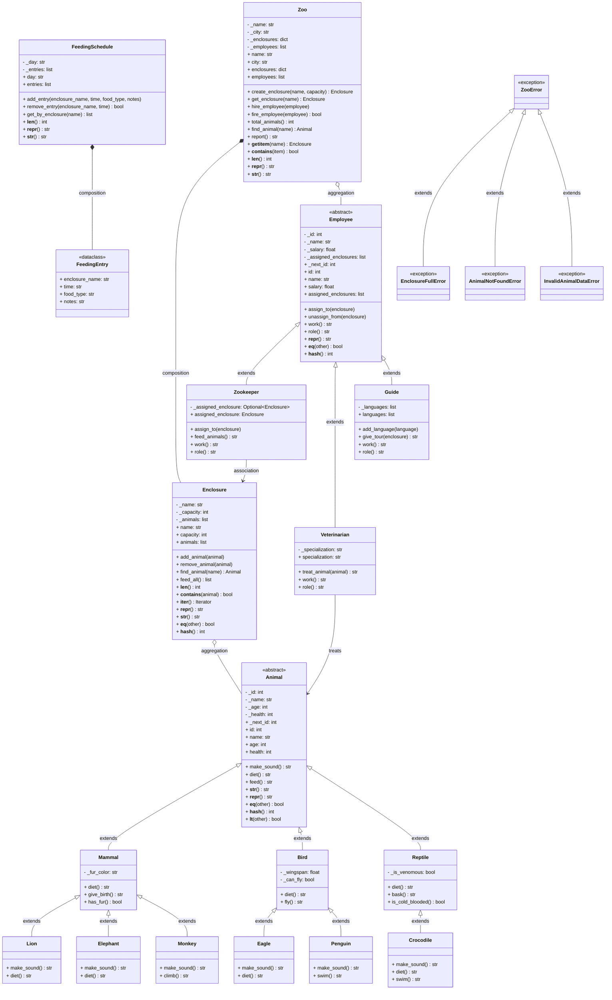

# UML Class Diagram — Zoo Garden



Aby otworzyć w draw.io:
1. Skopiuj całą zawartość bloku ` ```mermaid ... ``` `
2. Otwórz draw.io
3. Wybierz: Arrange → Insert → Advanced → Mermaid
4. Wklej kod diagramu
