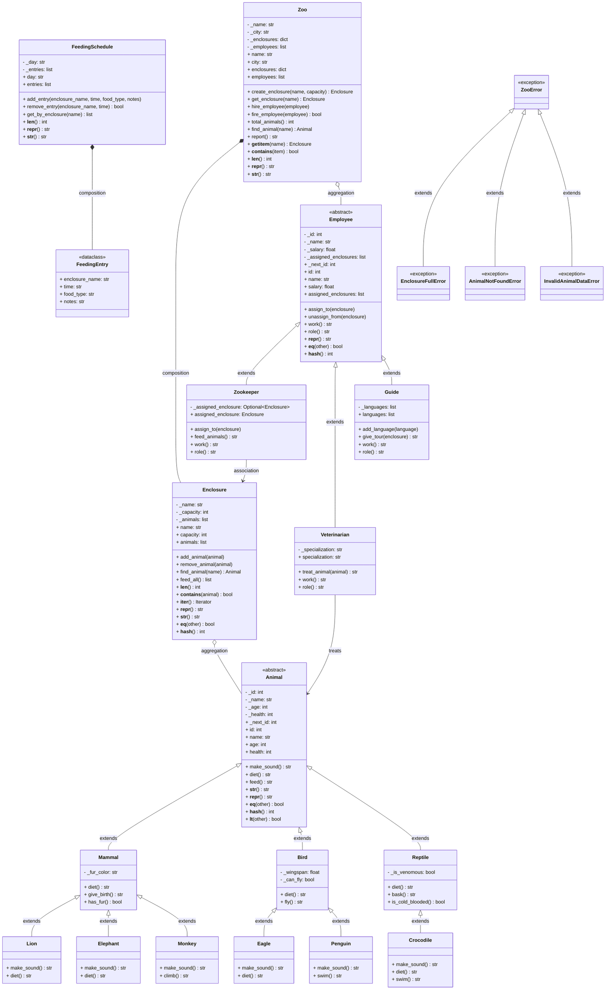

# UML Class Diagram — Zoo Garden (wersja edukacyjna)

> Diagram identyczny jak w `zoo_garden_diagram.md`, ale z szczegółowymi komentarzami
> objaśniającymi znaczenie każdej notacji UML i jej powiązanie z koncepcjami OOP.

---

## 1. Pełny diagram



---

## 2. Objaśnienie notacji UML i koncepcji OOP

### 2.1. Widoczność: `-` vs `+`

| Symbol | Znaczenie UML | Odpowiednik w OOP | W projekcie |
|--------|---------------|-------------------|-------------|
| **`-`** | *private* — składowa dostępna tylko wewnątrz klasy | **Enkapsulacja** – ukrycie implementacji | `- _name: str`, `- _health: int`, `- _animals: list` |
| **`+`** | *public* — składowa dostępna dla wszystkich | **Interfejs publiczny** klasy | `+ make_sound()`, `+ feed()`, `+ name: str` |

**Dlaczego akurat tu?**
- Pola z `-` (np. `_health`, `_animals`) są atrybutami wewnętrznymi — nikt spoza klasy nie powinien ich bezpośrednio modyfikować.
- Metody z `+` (np. `make_sound()`, `add_animal()`) to celowo wystawiony interfejs — one definiują, jak inni mogą wchodzić w interakcję z obiektem.
- **Wyjątek:** `+ _next_id: int` — to atrybut *klasy* (współdzielony przez wszystkie instancje), ale jest publiczny, ponieważ chcemy umożliwić odczyt z zewnątrz. W UML notujemy go jako `+`, choć w Pythonie konwencja `_` oznacza "chronione".

---

### 2.2. Konwencja nazewnicza: `_` vs `__`

| Prefix | Znaczenie w Pythonie | Przykład w projekcie |
|--------|---------------------|----------------------|
| **`_`** (pojedyncze) | *Protected* — konwencja mówiąca "nie ruszaj z zewnątrz" | `_name`, `_health`, `_animals` |
| **`__`** (podwójne) | *Name mangling* — Python zmienia nazwę na `_Klasa__attr` | Nie użyto w tym projekcie |

**Dlaczego `_` a nie `__`?**
- Pojedyncze `_` to wystarczająca ochrona w Pythonie — informuje programistę, że atrybut jest wewnętrzny.
- Podwójne `__` używamy, gdy chcemy uniknąć konfliktów w hierarchii dziedziczenia (np. gdy klasa potomna przypadkiem nadpisuje atrybut rodzica). W tym projekcie nie ma takiej potrzeby.

---

### 2.3. Metody specjalne (dunder): `__str__`, `__eq__`, `__len__` itd.

W UML notujemy je jako zwykłe metody publiczne z `+`. W Pythonie wyróżnia je podwójne underscore.

| Metoda | Cel w UML | Koncepcja OOP | W projekcie |
|--------|-----------|---------------|-------------|
| `__str__()` | Reprezentacja tekstowa dla użytkownika | **Przeciążanie operatorów** | `Animal.__str__()` → `"Simba the Lion"` |
| `__repr__()` | Reprezentacja dla debugowania | **Przeciążanie operatorów** | `Animal.__repr__()` → `"Lion(name='Simba', age=5)"` |
| `__eq__(other)` | Porównanie dwóch obiektów (`==`) | **Przeciążanie operatorów** | `Animal.__eq__()` → porównanie po `_id` |
| `__hash__()` | Pozwala użyć obiektu w zbiorach/słownikach | **Przeciążanie operatorów** | Wymagany razem z `__eq__` (Python tego wymaga) |
| `__lt__(other)` | Sortowanie (`<`) | **Przeciążanie operatorów** | `sorted(animals)` sortuje po `name` |
| `__len__()` | Długość obiektu (`len()`) | **Przeciążanie operatorów** | `len(enclosure)` → liczba zwierząt |
| `__contains__(item)` | Operator `in` | **Przeciążanie operatorów** | `lion in enclosure` |
| `__iter__()` | Iteracja (`for a in enclosure`) | **Przeciążanie operatorów** | `list(enclosure)` |
| `__getitem__(key)` | Indeksowanie (`zoo["Savanna"]`) | **Przeciążanie operatorów** | `zoo["Savanna"]` → zwraca Enclosure |

**Dlaczego umieszczamy je w konkretnych klasach?**
- `Animal.__eq__` porównuje po `_id` — każde zwierzę ma unikalne ID, więc to naturalny klucz.
- `Enclosure.__len__` zwraca liczbę zwierząt — nie ma sensu w `Zoo` (tam `__len__` to liczba wybiegów).
- `Zoo.__getitem__` pozwala na `zoo["Savanna"]` — naturalne, bo wybiegi są przechowywane w słowniku.

---

### 2.4. Stereotypy: `<<abstract>>`, `<<dataclass>>`, `<<exception>>`

| Stereotyp | Znaczenie UML | Koncepcja OOP | W projekcie |
|-----------|---------------|---------------|-------------|
| `<<abstract>>` | Klasa zawiera metody bez implementacji | **Klasa abstrakcyjna (ABC)** | `Animal`, `Employee` |
| `<<dataclass>>` | Klasa jest kontenerem danych z auto-generowanymi metodami | **`@dataclass`** | `FeedingEntry` |
| `<<exception>>` | Klasa reprezentuje błąd/wyjątek | **Własne wyjątki** | `ZooError` i pochodne |

**Dlaczego `Animal` i `Employee` są `<<abstract>>`?**
- Wymuszają implementację `make_sound()` / `diet()` / `work()` / `role()` w klasach potomnych.
- Nie można utworzyć `Animal()` bezpośrednio — Python rzuci `TypeError`.

**Dlaczego `FeedingEntry` jest `<<dataclass>>`?**
- To prosty kontener bez logiki biznesowej.
- `@dataclass` automatycznie generuje `__init__`, `__repr__`, `__eq__`, `__hash__`.
- Nie potrzebujemy enkapsulacji, bo to tylko dane (wszystkie pola są publiczne: `+`).

**Dlaczego wyjątki mają `<<exception>>`?**
- Dziedziczą po `Exception`, więc są rzucane (`raise`) i łapane (`try/except`).
- Hierarchia: `ZooError` → `EnclosureFullError`, `AnimalNotFoundError`, `InvalidAnimalDataError`.
- Dzięki bazowemu `ZooError` można złapać wszystkie błędy zoo jednym `except ZooError`.

---

### 2.5. Relacje między klasami

---

#### a) Dziedziczenie: `<|--` (strzałka z pustym trójkątem)

```
Animal <|-- Mammal : extends
```

| Element | Znaczenie UML | Koncepcja OOP |
|---------|---------------|---------------|
| `<|--` | Dziedziczenie (generalizacja) | **Dziedziczenie** — klasa potomna rozszerza bazową |
| `: extends` | Etykieta relacji | Opis relacji |

**Przykład:** `Mammal` dziedziczy po `Animal`:
```python
class Mammal(Animal):  # <|--
    def __init__(self, name, age, fur_color="brown"):
        super().__init__(name, age)  # super() – wywołanie konstruktora rodzica
```

**Wszystkie dziedziczenia w projekcie:**

| Rodzic | Dzieci | Uzasadnienie |
|--------|--------|-------------|
| `Animal` | `Mammal`, `Bird`, `Reptile` | Wspólne cechy (id, name, health) + abstrakcyjne metody |
| `Mammal` | `Lion`, `Elephant`, `Monkey` | Wspólne: fur, give_birth |
| `Bird` | `Eagle`, `Penguin` | Wspólne: wingspan, fly |
| `Reptile` | `Crocodile` | Wspólne: is_venomous, bask |
| `Employee` | `Zookeeper`, `Veterinarian`, `Guide` | Wspólne: id, salary, assign_to |
| `ZooError` | `EnclosureFullError`, `AnimalNotFoundError`, `InvalidAnimalDataError` | Hierarchia wyjątków |

---

#### b) Kompozycja: `*--` (wypełniony diament)

```
Zoo *-- Enclosure : composition
```

| Element | Znaczenie UML | Koncepcja OOP |
|---------|---------------|---------------|
| `*--` | Kompozycja – silne "has-a" | **Kompozycja** |
| Wypełniony diament | Obiekt zawierający (owner) | Strona "całości" |
| Druga strona | Obiekt zawierany (part) | Strona "części" |

**Zasada:** Jeśli usuniemy obiekt nadrzędny, obiekty podrzędne również zostają usunięte. Części nie istnieją bez całości.

**W projekcie:**
```python
class Zoo:
    def __init__(self, name, city="Lodz"):
        self._enclosures: dict[str, Enclosure] = {}  # *-- kompozycja
```

- `Zoo` tworzy wybiegi (`create_enclosure()`) i przechowuje je w `_enclosures`.
- Jeśli `Zoo` zostanie usunięte, `Enclosure` też nie istnieją.
- **Dlaczego tutaj?** Wybieg bez zoo nie ma sensu — jest zawsze częścią konkretnego ogrodu.

Analogicznie: `FeedingSchedule *-- FeedingEntry` — wpisy harmonogramu są tworzone przez harmonogram i bez niego nie istnieją.

---

#### c) Agregacja: `o--` (pusty diament)

```
Enclosure o-- Animal : aggregation
```

| Element | Znaczenie UML | Koncepcja OOP |
|---------|---------------|---------------|
| `o--` | Agregacja – słabe "has-a" | **Agregacja** |
| Pusty diament | Obiekt zawierający | Strona "całości" |
| Druga strona | Obiekt zawierany (może istnieć samodzielnie) | Strona "części" |

**Zasada:** Obiekty podrzędne mogą istnieć niezależnie od nadrzędnego.

**W projekcie:**
```python
class Enclosure:
    def __init__(self, name, capacity):
        self._animals: list = []  # o-- agregacja
```

- `Enclosure` zawiera zwierzęta, ale zwierzę może być przeniesione do innego wybiegu.
- Usunięcie wybiegu **nie usuwa** zwierzęcia — ono istnieje nadal (może trafić do innego wybiegu).
- **Dlaczego tutaj?** Zwierzęta są wartością samą w sobie — mają własne ID, health itd.

Analogicznie: `Zoo o-- Employee` — pracownik może odejść z pracy lub być zatrudniony gdzie indziej.

---

#### d) Asocjacja: `-->` (zwykła strzałka)

```
Zookeeper --> Enclosure : association
```

| Element | Znaczenie UML | Koncepcja OOP |
|---------|---------------|---------------|
| `-->` | Asocjacja – słabe powiązanie | **Asocjacja** |
| Strzałka | Kierunek zależności | Kto zna kogo |

**Zasada:** Obiekty są powiązane, ale żaden nie "zawiera" drugiego. Mogą istnieć całkowicie niezależnie.

**W projekcie:**
```python
class Zookeeper(Employee):
    def assign_to(self, enclosure):
        self._assigned_enclosure = enclosure
```

- Opiekun może być przypisany do wybiegu, ale wybieg istnieje bez opiekuna i opiekun bez wybiegu.
- **Dlaczego tutaj?** To relacja czysto funkcjonalna — opiekun *zostaje przypisany* do wybiegu, nie jest jego właścicielem.

---

### 2.6. Własności (`@property`) – enkapsulacja w akcji

W UML własności wyglądają jak zwykłe publiczne atrybuty (`+ name: str`), ale w Pythonie są implementowane jako metody z dekoratorem `@property`. To kluczowy element **enkapsulacji**.

**Przykład z `Animal`:**
```python
class Animal:
    @property
    def health(self) -> int:      # + health: int (getter)
        return self._health

    @health.setter
    def health(self, value):       # (setter z walidacją)
        self._health = max(0, min(100, value))  # clamping 0-100
```

| UML | Kod | Koncepcja OOP |
|-----|-----|---------------|
| `+ health: int` | `@property` → `def health(self)` | **Enkapsulacja** – kontrolowany dostęp |
| (setter niewidoczny w UML) | `@health.setter` → `def health(self, value)` | **Walidacja danych** – clamping 0-100 |

**Gdzie występuje w projekcie:**
- `Animal.health` – clamping 0-100 (`max(0, min(100, value))`)
- `Animal.name` – walidacja niepustej nazwy
- `Employee.salary` – walidacja nieujemnej pensji
- `Enclosure.animals` – zwraca kopię listy (`list(self._animals)`)
- `Zoo.enclosures`, `Zoo.employees` – zwracają kopie kolekcji

**Dlaczego to ważne?**
- Bez settera w `Animal.health` można by ustawić `health = 500` — dane byłyby niespójne.
- Bez kopii w `Enclosure.animals` kod zewnętrzny mógłby dodać zwierzę przez `enclosure.animals.append(...)` z pominięciem walidacji pojemności.

---

### 2.7. Atrybuty klasy: `+ _next_id: int`

```
    class Animal {
        + _next_id: int   # ← to jest atrybut KLASY, nie instancji
        - _id: int        # ← to jest atrybut instancji
    }
```

| Aspekt | Atrybut klasy (`_next_id`) | Atrybut instancji (`_id`) |
|--------|---------------------------|---------------------------|
| Własność | Należy do **klasy** | Należy do **obiektu** |
| Współdzielenie | Jeden dla wszystkich instancji | Każdy obiekt ma swój |
| Modyfikacja | Zmiana widoczna we wszystkich obiektach | Zmiana dotyczy tylko jednego obiektu |

```python
class Animal:
    _next_id: int = 1        # atrybut klasy

    def __init__(self, name, age):
        self._id = Animal._next_id  # atrybut instancji
        Animal._next_id += 1        # inkrementacja atrybutu klasy
```

**Dlaczego to ważne?**
- Zapewnia unikalność ID — każde nowe zwierzę dostaje kolejny numer.
- `_next_id` jest przechowywany w klasie, więc po utworzeniu 10 zwierząt `Animal._next_id` = 11.
- Każda podklasa (Lion, Eagle itd.) **współdzieli** ten sam licznik z `Animal` — nie ma osobnych liczników dla każdego gatunku (to odpowiedź na pytanie 13 z sekcji 4 specyfikacji).

---

### 2.8. Polimorfizm – ta sama metoda, różne implementacje

Polimorfizm nie jest bezpośrednio widoczny w diagramie UML jako osobna notacja, ale przejawia się w **wielu klasach mających tę samą metodę**.

```
Lion:    + make_sound() str   → "Roar!"
Elephant:+ make_sound() str   → "Trumpet!"
Eagle:   + make_sound() str   → "Screech!"
Penguin: + make_sound() str   → "Honk!"
Crocodile:+ make_sound() str  → "Hiss!"
```

```python
animals = [Lion("Simba",5), Eagle("Freedom",4), Crocodile("Snap",8)]
for a in animals:
    print(a.make_sound())  # Każdy odpowiada inaczej – POLIMORFIZM
```

| Koncepcja OOP | Gdzie widać na diagramie |
|---------------|--------------------------|
| **Polimorfizm** | `make_sound()` w Lion, Elephant, Monkey, Eagle, Penguin, Crocodile |
| **Duck typing** | `work()` i `role()` w Zookeeper, Veterinarian, Guide |
| **Przeciążanie operatorów** | `__eq__`, `__lt__`, `__len__` itd. w różnych klasach |

---

### 2.9. `super()` i nadpisywanie (override)

Gdy klasa potomna ma metodę o tej samej nazwie co rodzic:

```
Mammal:  + diet() str   → "Mammals are herbivores..."
Lion:    + diet() str   → "Lions are carnivores..."   # NADPISANIE (override)
```

W klasach, które *nie* nadpisują metody (np. `Monkey`, `Penguin`), strzałka `<|--` oznacza, że dziedziczą implementację rodzica.

```python
class Lion(Mammal):
    def diet(self) -> str:          # NADPISANIE
        return "Lions are carnivores..."

class Monkey(Mammal):
    pass  # Brak diet() – dziedziczy z Mammal
```

**Dlaczego niektóre klasy nadpisują, a inne nie?**
- `Monkey` nie nadpisuje `diet()` → ogólna dieta ssaków jest wystarczająca.
- `Lion` nadpisuje `diet()` → lwy mają wyspecjalizowaną dietę mięsożerną.
- `Penguin` nie nadpisuje `diet()` → ogólna dieta ptaków jest adekwatna.

---

### 2.10. `isinstance()` i `issubclass()` – sprawdzanie typów

Te funkcje są często używane w kodzie, choć nie pojawiają się bezpośrednio w UML:

```python
isinstance(lion, Lion)     # True
isinstance(lion, Mammal)   # True  (bo Lion dziedziczy Mammal)
isinstance(lion, Animal)   # True  (bo Mammal dziedziczy Animal)
issubclass(Lion, Animal)   # True
```

**Gdzie w projekcie?**
- `Animal.__eq__(other)` w `zoo/animals/animal.py:73` sprawdza `isinstance(other, Animal)`
- `Zoo.__contains__(item)` w `zoo/zoo.py:131-134` sprawdza `isinstance(item, Enclosure)` / `isinstance(item, Employee)`

---

## 3. Podsumowanie – mapa koncepcji OOP na diagram

| Koncepcja OOP | Notacja UML | Gdzie na diagramie |
|---------------|-------------|-------------------|
| **Klasa abstrakcyjna** | `<<abstract>>` | `Animal`, `Employee` |
| **Dziedziczenie** | `<|--` | 12 strzałek extends |
| **Polimorfizm** | `+ make_sound()` w 6 klasach | Lion..Crocodile |
| **Enkapsulacja** | `-` vs `+` | Wszystkie klasy |
| **Własności (`@property`)** | `+ name/health/salary` | `Animal`, `Employee`, `Enclosure` |
| **Kompozycja** | `*--` | `Zoo`→`Enclosure`, `FeedingSchedule`→`FeedingEntry` |
| **Agregacja** | `o--` | `Enclosure`→`Animal`, `Zoo`→`Employee` |
| **Asocjacja** | `-->` | `Zookeeper`→`Enclosure`, `Veterinarian`→`Animal` |
| **Metody specjalne** | `__str__`, `__eq__`, `__len__` itd. | W klasach, gdzie mają sens |
| **Atrybut klasy** | `+ _next_id` (widoczny w sekcji pól) | `Animal`, `Employee` |
| **`@dataclass`** | `<<dataclass>>` | `FeedingEntry` |
| **Hierarchia wyjątków** | `<<exception>>` + `<|--` | `ZooError` i pochodne |
| **Nadpisywanie** | Ta sama metoda w rodzic + dzieci | `make_sound()`, `diet()`, `work()`, `role()` |
| **super()** | Niewidoczne w UML (wewnętrzne) | `__init__` w Mammal, Bird, Reptile itd. |
